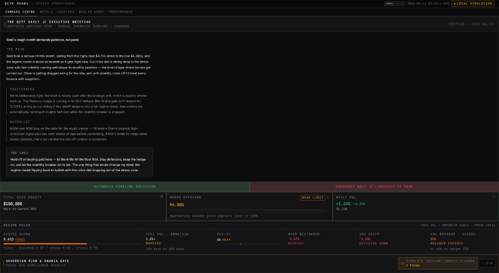

<div align="center">

# Altair MK1 · Full-Stack Quantitative Trading Engine

**A 120-engine institutional-grade quantitative trading platform**
**bridging a Next.js operator terminal to a Python/FastAPI mathematical engine.**

*Autonomous regime detection · Sharia-compliant capital routing · Live paper-trading execution*

[](https://python.org)
[](https://nextjs.org)
[](https://fastapi.tiangolo.com)
[](https://tailwindcss.com)
[](./LICENSE)

</div>

---



---

## Executive Summary

The **QCTF Model** (Quantitative Commodity & Treasury Forecasting) is a full-stack autonomous trading engine that:

1. **Ingests** heterogeneous market data from yfinance, FRED, Perplexity Sonar, and alternative datasets — normalised into a time-aligned feature panel with strict look-ahead bias controls.
2. **Detects** market regime shifts via a dual-timeframe volatility engine (5-day fast EWMA vs. 21-day base), a Hidden Markov Model crisis detector, and a structural-break scanner — classifying conditions as *elevated*, *stress*, or *crisis* in real-time.
3. **Decides** position sizing through a proprietary conviction-weighted stacking framework that blends momentum, mean-reversion, carry, and macro signals with regime-adaptive Kelly sizing.
4. **Executes** trades on an Alpaca paper-trading account with a fractional-share order router, slippage tracking, and a full audit trail written to JSONL.
5. **Explains** every decision through a "Newsletter-Style" DeepSeek Chief Risk Officer intelligence loop — a 2,000-word daily executive briefing generated from the full pipeline state.
6. **Enforces** Sharia compliance at the capital-routing layer: the Phase XXV Sovereign Gate automatically reroutes blocked Treasury capital (TLT/IEF) into Physical Gold (GLD).

The operator UI is a military-grade terminal dashboard (Next.js 16 / Tailwind CSS 4 / Recharts) that surfaces the full pipeline state in real-time — regime pulse, strategy attribution, holdings grid, and an AUTHORIZE / EMERGENCY HALT control bar — while defaulting to a **recruiter-safe Local Sandbox Simulation** mode that renders the complete dashboard from mock data without any live API dependency.

---

## Architecture Overview

```
                    ┌─────────────────────────────────────────────┐
                    │          NEXT.JS 16 TERMINAL UI             │
                    │    Tailwind CSS 4 · Recharts · React 19     │
                    │                                             │
                    │  ┌─────────┐ ┌──────────┐ ┌─────────────┐  │
                    │  │ Command │ │ Regime   │ │ Executive   │  │
                    │  │ Centre  │ │ Pulse    │ │ Briefing    │  │
                    │  └────┬────┘ └────┬─────┘ └──────┬──────┘  │
                    │       │           │              │          │
                    │  ┌────┴───────────┴──────────────┴──────┐  │
                    │  │   DeploymentProvider (Sandbox Lock)   │  │
                    │  └──────────────────┬───────────────────┘  │
                    └─────────────────────┼──────────────────────┘
                                          │
                               /qctf-backend proxy
                                          │
                    ┌─────────────────────┼──────────────────────┐
                    │        FASTAPI BRIDGE (api/server.py)       │
                    │   REST /api/snapshot · WebSocket /ws        │
                    │   Admin auth · Market data ingest worker    │
                    └─────────────────────┬──────────────────────┘
                                          │
          ┌───────────────────────────────┼───────────────────────────────┐
          │                               │                               │
   ┌──────┴──────┐               ┌───────┴───────┐              ┌───────┴───────┐
   │  120-ENGINE  │               │  EXECUTION    │              │  TELEMETRY    │
   │  MATH STACK  │               │  LAYER        │              │  LAYER        │
   │              │               │               │              │               │
   │ Regime Det.  │               │ Alpaca Router │              │ Telegram Bot  │
   │ Crisis HMM   │               │ Virtual Trader│              │ Audit Trail   │
   │ Vol Target   │               │ Shadow Book   │              │ JSONL Logs    │
   │ Alpha Stack  │               │ Phase XIV Book│              │ Pipeline State│
   │ Kelly Sizing │               │ Order Router  │              │               │
   │ DeepSeek CRO │               │ Slippage Trk  │              │               │
   └──────────────┘               └───────────────┘              └───────────────┘
```

### Decoupled Stack

| Layer | Technology | Responsibility |
|-------|-----------|----------------|
| **Operator Terminal** | Next.js 16, React 19, Tailwind CSS 4, Recharts | Real-time dashboard with sandbox/production mode toggle |
| **API Bridge** | FastAPI 0.115, Uvicorn, WebSocket | Thin shim reading pipeline JSON files, serving REST + live push |
| **Mathematical Engine** | Python 3.12, NumPy, Pandas, SciPy, HMMLearn, LightGBM | 120 autonomous engines: regime detection → signal generation → sizing → execution |
| **Execution** | Alpaca-py, internal Virtual Trader | Paper-trading with fractional shares, audit trail, daily reconciliation |
| **Intelligence** | DeepSeek API, Perplexity Sonar Pro | CRO briefings, macro sentiment scoring, trade autopsy |
| **Telemetry** | Telegram Bot API | Heartbeats, execution confirms, compliance alerts, operator halt notifications |

---

## Core Innovations

### 1. Newsletter-Style DeepSeek CRO Intelligence Loop

The system generates a **2,000-word daily executive briefing** by:
- Collecting the full `pipeline_state.json` (regime, positions, P&L, signals, risk metrics)
- Distilling it into a structured dossier with citation keys
- Prompting DeepSeek with a trained persona: a Chief Risk Officer writing to the portfolio manager
- Outputting five sections: **THE READ** (macro narrative), **POSITIONING** (book status), **WATCHLIST** (entries to monitor), **THE CALL** (actionable recommendation), and **RISK FLAGS**

The briefing is served via `/api/executive-summary` and rendered in the terminal's **Executive Briefing** panel with an AUTHORIZE / EMERGENCY HALT control bar.

### 2. Phase XXV Sharia-Compliance Sovereign Gate

A macro-regime hedge sleeve allocates into Treasury ETFs (TLT/IEF) during deflation or crisis regimes. The **Sharia Gate** enforces a hard constraint:

```
if TREASURY_SHARIA_CLEARED ≠ true:
    reroute sleeve budget → GLD (Physical Gold proxy)
    tag: strategy=TREASURY_HEDGE, sub_tag=sharia_fallback_gld
```

This is not a soft preference — it is a **capital-routing gate** that blocks coupon-bearing sovereign debt at the execution layer. The gate state is displayed in the Compliance Panel and broadcast via Telegram on every transition.

### 3. Live Alpaca Paper-Trading Execution

The execution pipeline reads `equity_decision.json` (today's Top-3 halal equity picks), then:
1. **Liquidates** stale positions not in today's roster
2. **Polls** for FILLED status (2s intervals, 30s timeout)
3. **Submits** notional BUY orders with automatic fractional-share fallback
4. **Logs** every event to `trade_log.jsonl` (permanent audit trail)
5. **Broadcasts** execution summary to Telegram

A separate **Virtual Trader** maintains a shadow book (`phase14_book.json`) for the multi-strategy alpha sleeve with mark-to-market refreshes every 5 minutes.

### 4. Volatility & Regime Detection

The regime engine combines three independent detectors:

| Detector | Method | Output |
|----------|--------|--------|
| **Crisis Score** | Dual-timeframe EWMA (5d fast / 21d base) | 0.0 – 1.0 continuous score; thresholds at 0.30 (elevated), 0.50 (stress), 0.70 (crisis) |
| **HMM Regime** | 3-state Hidden Markov Model on returns + vol features | Bull / Sideways / Bear state probabilities |
| **Structural Breaks** | CUSUM + Bai-Perron on rolling statistics | Breakpoint detection with confidence intervals |

When the **volatility breaker** engages (blended realised vol exceeds the annualised target), new entry notionals scale by `target / realised`, floored at 25% of intended size. The hedge sleeve is exempt.

---

## Technology Stack

| Category | Technologies |
|----------|-------------|
| **Frontend** | Next.js 16, React 19, TypeScript 5, Tailwind CSS 4, Recharts, Lucide Icons |
| **Backend** | Python 3.12, FastAPI, Uvicorn, WebSocket |
| **Data Science** | NumPy, Pandas, SciPy, Statsmodels, HMMLearn, LightGBM, Optuna |
| **Market Data** | yfinance, FRED API (fredapi), Perplexity Sonar Pro |
| **Execution** | Alpaca-py (paper trading), custom Virtual Trader |
| **Intelligence** | DeepSeek API (CRO briefings), Perplexity (macro sentiment) |
| **Telemetry** | Telegram Bot API (alerts, heartbeats, compliance) |
| **Infrastructure** | Docker, macOS LaunchAgent (cron scheduling), dotenv |
| **Testing** | pytest, pytest-mock, pytest-cov |
| **Linting** | ESLint, Ruff, mypy |

---

## Repository Layout

```
.
├── README.md                       ← you are here
├── showcase.png                    ← terminal dashboard screenshot
├── .env.example                    ← credential template (no real keys)
├── .gitignore                      ← hardened: blocks .env, private notes, data/
├── LICENSE                         ← MIT
│
├── app/                            ← Next.js 16 pages + global styles
│   ├── layout.tsx                  ← root layout with DeploymentProvider
│   ├── page.tsx                    ← entry point → <Dashboard />
│   └── globals.css                 ← Tailwind CSS 4 base
│
├── components/                     ← React UI components
│   ├── Dashboard.tsx               ← main orchestrator (sandbox-aware)
│   ├── ExecutiveBriefing.tsx       ← CRO newsletter + AUTHORIZE/HALT
│   ├── CompliancePanel.tsx         ← Sharia gate display
│   ├── RegimePulse.tsx             ← crisis score + regime indicators
│   ├── StrategyAttribution.tsx     ← allocation breakdown charts
│   ├── HoldingsTable.tsx           ← position grid with P&L
│   ├── MetricsBar.tsx              ← top-line KPI strip
│   ├── PerformanceHero.tsx         ← equity curve + attribution chart
│   ├── providers/                  ← DeploymentProvider (sandbox lock)
│   ├── dashboard/                  ← shell + tab sections
│   └── shell/                      ← Header, NavTabs, ModuleCard
│
├── hooks/                          ← custom React hooks
│   ├── useDashboardSnapshot.ts     ← 3s poll (sandbox: mock data)
│   ├── useExecutiveSummary.ts      ← CRO briefing fetch
│   ├── useRegimePulse.ts           ← 60s regime polling
│   └── useClock.ts                 ← UTC clock display
│
├── lib/                            ← shared utilities + mock data
│   ├── config.ts                   ← dashboard mode resolution + API URL
│   ├── api/                        ← snapshot, override, exec-summary fetchers
│   ├── mock-data.ts                ← Phase XXV sandbox dataset
│   ├── mock-executive-summary.ts   ← CRO briefing mock
│   ├── mock-holdings.ts            ← position grid mock
│   ├── mock-regime-pulse.ts        ← regime indicators mock
│   └── types.ts                    ← TypeScript interfaces
│
├── api/                            ← FastAPI backend
│   └── server.py                   ← REST + WebSocket bridge (1,472 lines)
│
├── scripts/                        ← 120 Python engine modules
│   ├── master_controller.py        ← daily pipeline orchestrator (177KB)
│   ├── deepseek_explainer.py       ← CRO intelligence loop
│   ├── alpaca_trader.py            ← live paper-trading execution
│   ├── telegram_notifier.py        ← telemetry broadcast
│   ├── regime_detector.py          ← EWMA + HMM regime engine
│   ├── crisis_detector.py          ← crisis score calculator
│   ├── strategy_selector.py        ← conviction-weighted signal stacker
│   ├── risk_manager.py             ← position sizing + drawdown control
│   ├── equity_logic.py             ← halal equity screening + ranking
│   ├── treasury_hedge_overlay.py   ← Phase XXV Sharia gate
│   ├── walk_forward_backtest.py    ← walk-forward validation
│   ├── kelly_sizing.py             ← fractional Kelly position sizing
│   ├── vol_target_budget.py        ← volatility-targeting circuit breaker
│   └── ... (106 more engines)
│
├── agents/                         ← AI agent modules
│   ├── perplexity_oracle.py        ← macro sentiment via Sonar Pro
│   ├── mcp_broker.py               ← model context protocol broker
│   └── equity_swarm/               ← multi-agent equity analysis
│
├── execution/                      ← trade execution layer
│   └── virtual_trader.py           ← shadow book + mark-to-market
│
├── data_pipelines/                 ← feature engineering
│   ├── equity_features.py          ← technical + fundamental features
│   └── multi_asset_feed.py         ← multi-asset data normalisation
│
├── metals/                         ← commodity-specific modules
│   ├── gold/    silver/    platinum/
│   ├── copper/  iron/      lithium/
│
├── models/                         ← trained model artefacts (gitignored)
├── data/                           ← pipeline state + logs (gitignored)
│
├── Dockerfile                      ← production container (dashboard + scheduler)
├── entrypoint.sh                   ← Docker entrypoint
├── launch_production.sh            ← Streamlit + Tailscale launcher
├── requirements.txt                ← Python runtime dependencies
├── package.json                    ← Node.js dependencies
├── next.config.ts                  ← proxy rewrite (3000 → 8000)
├── tailwind.config.js              ← Tailwind CSS configuration
└── tsconfig.json                   ← TypeScript configuration
```

---

## Quick Start — Local Sandbox Simulation

> **No API keys required.** The dashboard boots in `RECRUITER SANDBOX` mode by default, rendering the full UI from embedded mock data. The backend is not needed.

```bash
# 1. Clone the repository
git clone https://github.com/qusaialtair/quantitative-commodity-forecast.git
cd quantitative-commodity-forecast

# 2. Install Node.js dependencies
npm install

# 3. Boot the terminal dashboard (sandbox mode)
npm run dev
```

Open **http://localhost:3000** — you will see the full Altair MK1 terminal with:
- Executive Briefing (CRO newsletter with mock data)
- Regime Pulse (crisis score, volatility, MACD, momentum)
- Strategy Attribution (alpha allocation breakdown)
- Holdings Grid (open positions with P&L)
- Compliance Panel (Sharia gate status)
- AUTHORIZE / EMERGENCY HALT control bar

The top-right badge will read **`LOCAL SIMULATION`** — confirming no live API calls are being made.

### Full Stack (with Python Backend)

```bash
# 1. Set up Python environment
python3 -m venv .venv && source .venv/bin/activate
pip install -r requirements.txt

# 2. Configure credentials
cp .env.example .env
# Edit .env — set DEEPSEEK_API_KEY, ALPACA_API_KEY, TELEGRAM_BOT_TOKEN, etc.

# 3. Launch the FastAPI backend
python3 -m uvicorn api.server:app --reload --port 8000

# 4. In a second terminal, toggle the dashboard to production mode
NEXT_PUBLIC_DASHBOARD_MODE="PRODUCTION AUTOMATED" npm run dev
```

---

## Engine Inventory (120 Modules)

<details>
<summary><strong>Click to expand full engine list</strong></summary>

### Signal Generation & Alpha
| Engine | Purpose |
|--------|---------|
| `alpha_stacker.py` | Multi-signal conviction stacking |
| `strategy_selector.py` | Regime-adaptive strategy selection |
| `strategy_backtester.py` | Historical strategy validation |
| `metal_logic.py` | Precious metals signal generation |
| `equity_logic.py` | Halal equity screening + ranking |
| `cointegration_engine.py` | Pairs trading cointegration tests |
| `mtf_confluence.py` | Multi-timeframe signal confluence |
| `signal_decay.py` | Alpha signal half-life analysis |
| `ic_ir_tracker.py` | Information coefficient tracking |
| `trade_idea_generator.py` | Automated trade idea synthesis |
| `oracle_engine.py` | Macro oracle signal aggregation |

### Risk Management
| Engine | Purpose |
|--------|---------|
| `risk_manager.py` | Position sizing + drawdown control |
| `crisis_detector.py` | EWMA crisis score (0.0–1.0) |
| `regime_detector.py` | HMM + structural break detection |
| `vol_target_budget.py` | Volatility-targeting circuit breaker |
| `drawdown_controller.py` | Max drawdown enforcement |
| `stress_tester.py` | Historical stress scenario replay |
| `tail_risk_engine.py` | Tail risk quantification (CVaR) |
| `tail_hedge_overlay.py` | Protective put overlay |
| `correlation_monitor.py` | Cross-asset correlation surveillance |
| `adverse_selection.py` | Adverse selection detection |
| `stop_loss_optimizer.py` | Optimal stop-loss placement |

### Portfolio Construction
| Engine | Purpose |
|--------|---------|
| `black_litterman.py` | Black-Litterman allocation |
| `hrp_allocator.py` | Hierarchical Risk Parity |
| `mean_cvar_optimizer.py` | Mean-CVaR optimisation |
| `kelly_sizing.py` | Fractional Kelly position sizing |
| `conviction_weights_optimizer.py` | Conviction-weighted allocation |
| `regime_adaptive_allocator.py` | Regime-conditional allocation |
| `portfolio_manager.py` | Portfolio-level orchestration |
| `position_manager.py` | Position lifecycle management |

### Execution & Trading
| Engine | Purpose |
|--------|---------|
| `alpaca_trader.py` | Alpaca paper-trading router |
| `virtual_trader.py` | Internal shadow book management |
| `shadow_trader.py` | Shadow portfolio tracking |
| `multi_strategy_trader.py` | Multi-strategy execution |
| `smart_order_router.py` | Intelligent order routing |
| `order_router.py` | Basic order routing |
| `trade_basket.py` | Basket order construction |
| `position_reconciler.py` | Position reconciliation |
| `slippage_tracker.py` | Execution slippage analysis |
| `transaction_cost_model.py` | Transaction cost estimation |
| `treasury_hedge_overlay.py` | Phase XXV Sharia gate |

### Machine Learning & Backtesting
| Engine | Purpose |
|--------|---------|
| `walk_forward_backtest.py` | Walk-forward validation (42KB) |
| `walk_forward_validator.py` | WF parameter stability |
| `bayesian_hpo.py` | Bayesian hyperparameter optimisation |
| `bayesian_model_averaging.py` | Bayesian model averaging |
| `ensemble_stacking.py` | Ensemble stacking framework |
| `ml_conviction_poc.py` | ML conviction proof-of-concept |
| `ml_walk_forward.py` | ML walk-forward pipeline |
| `purged_kfold.py` | Purged K-fold cross-validation |
| `rl_sizing_agent.py` | Reinforcement learning sizer |
| `continuous_trainer.py` | Online model retraining |
| `conformal_intervals.py` | Conformal prediction intervals |

### Intelligence & Explainability
| Engine | Purpose |
|--------|---------|
| `deepseek_explainer.py` | CRO intelligence loop (45KB) |
| `executive_briefer.py` | Daily briefing generation |
| `perplexity_oracle.py` | Macro sentiment via Sonar Pro |
| `cb_speech_analyzer.py` | Central bank speech parsing |
| `news_sentiment.py` | News sentiment analysis |
| `geopolitical_detector.py` | Geopolitical risk scoring |
| `trade_autopsy.py` | Post-trade analysis |
| `decision_quality.py` | Decision quality scoring |
| `memory_consolidator.py` | Cross-session memory |

### Data & Infrastructure
| Engine | Purpose |
|--------|---------|
| `master_controller.py` | Daily pipeline orchestrator (177KB) |
| `daily_booter.py` | System boot sequence |
| `daily_trainer.py` | Nightly model retraining |
| `model_evaluator.py` | Weekly model grading |
| `cache_layer.py` | Intelligent caching |
| `data_quality.py` | Data quality validation |
| `system_health.py` | System health monitoring |
| `system_health_check.py` | Deep health diagnostics |
| `telegram_notifier.py` | Telegram telemetry |
| `alert_router.py` | Alert routing + dedup |
| `audit_trail.py` | Compliance audit trail |
| `operator_runbook.py` | Runbook automation |
| `watchdog_monitor.py` | Process watchdog |
| `dr_backup.py` | Disaster recovery backup |
| `latency_profiler.py` | Performance profiling |
| `capacity_analyzer.py` | Strategy capacity analysis |

### Analytics & Reporting
| Engine | Purpose |
|--------|---------|
| `tear_sheet.py` | Performance tear sheet |
| `brinson_attribution.py` | Brinson attribution analysis |
| `alpha_attribution.py` | Alpha source attribution |
| `pnl_tracker.py` | P&L tracking |
| `performance_targeter.py` | Performance targeting |
| `model_performance_tracker.py` | Model performance tracking |
| `monte_carlo.py` | Monte Carlo simulation |
| `fama_french.py` | Fama-French factor analysis |

### Market Microstructure
| Engine | Purpose |
|--------|---------|
| `term_structure.py` | Futures term structure |
| `carry_analyzer.py` | Carry signal extraction |
| `vol_surface.py` | Volatility surface modelling |
| `options_pricer.py` | Options pricing (BSM) |
| `dcc_garch.py` | DCC-GARCH correlation |
| `structural_breaks.py` | Structural break detection |
| `economic_calendar.py` | Economic event calendar |
| `earnings_calendar.py` | Earnings event calendar |
| `etf_flow_tracker.py` | ETF flow analysis |
| `macro_regime.py` | Macro regime classification |
| `macro_nowcast.py` | GDP/inflation nowcasting |

</details>

---

## Sandbox Mode Architecture

The dashboard implements a **three-layer sandbox lock** to ensure public users never hit a dead localhost:

```
Layer 1: NODE_ENV === "production"  →  ALWAYS forces RECRUITER SANDBOX
Layer 2: NEXT_PUBLIC_DASHBOARD_MODE →  defaults to "RECRUITER SANDBOX"
Layer 3: resolveDashboardMode()     →  final fallback = "RECRUITER SANDBOX"
```

When in sandbox mode:
- `useDashboardSnapshot` returns mock data — **zero network calls**
- `useExecutiveSummary` returns a pre-written CRO briefing
- `useRegimePulse` returns static regime indicators
- The API status badge reads `LOCAL SIMULATION`
- The AUTHORIZE / HALT buttons are rendered but inert

---

## License

This project is licensed under the [MIT License](./LICENSE).

---

<div align="center">

**Built by [Qusai Altair](https://github.com/qusaialtair)** · Dubai, UAE

*Quantitative Engineering · Autonomous Systems · Institutional-Grade Architecture*

</div>
